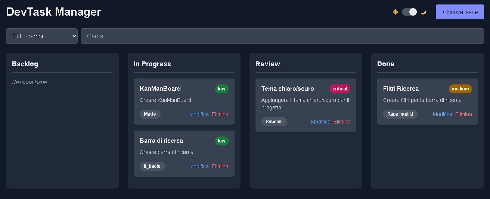
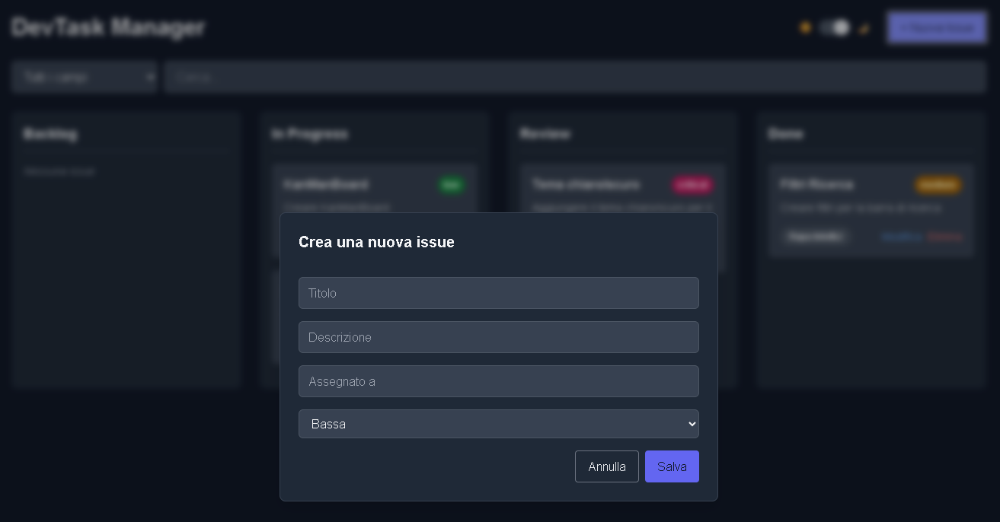

# DevTask Manager - Kanban Board

## Descrizione del progetto
DevTask Manager è un'applicazione web **Kanban** completamente lato client per la gestione delle issue e dei task di un progetto.  
L'app permette di creare, modificare, eliminare e spostare le issue tra le colonne della board: **Backlog, In Progress, Review e Done**.  
Tutte le informazioni vengono salvate localmente nel browser tramite **localStorage**, senza necessità di backend o autenticazione.  
Supporta inoltre **modalità chiara/scura**, ricerca e filtraggio delle issue in tempo reale, rendendo la gestione dei task semplice e veloce.

## Funzionalità principali
- Creazione di nuove issue con titolo, descrizione, assegnatario e priorità.
- Visualizzazione delle issue organizzate in quattro colonne:
  - Backlog
  - In Progress
  - Review
  - Done
- Spostamento delle issue tra le colonne con **drag & drop**.
- Modifica ed eliminazione delle issue.
- Ricerca e filtro delle issue in tempo reale su tutti i campi o su campi specifici.
- Supporto al tema chiaro/scuro con salvataggio della preferenza nel browser.
- UI responsiva, chiara e moderna, sviluppata con **Tailwind CSS**.
- Persistenza dei dati nel **localStorage**, nessun backend richiesto.

## Tecnologie utilizzate
- **HTML / CSS**
- **JavaScript**
- **Tailwind CSS**
- LocalStorage del browser

## Requisiti Funzionali

### Must Have
- Creazione issue tramite form dedicato
- Inserimento automatico delle issue nella colonna **Backlog**
- Visualizzazione issue nelle colonne: Backlog, In Progress, Review, Done
- Drag & drop tra colonne
- Eliminazione issue tramite pulsante
- Aggiornamento automatico della board ad ogni operazione
- Persistenza locale dei dati con **localStorage**
- Caricamento automatico delle issue all’avvio
- Ricerca e filtro in tempo reale su titolo, descrizione, assegnatario e priorità

### Should Have
- Interruttore per tema chiaro/scuro
- Apertura/chiusura form issue tramite pulsanti
- Salvataggio della preferenza di tema nel browser

### Could Have
- Pulsanti e azioni facili da individuare e usare
- Possibilità futura di modificare il contenuto delle issue dopo la creazione

### Never Have
- Nessun backend o server remoto
- Nessuna sincronizzazione tra dispositivi
- Nessuna autenticazione o gestione utenti

## Requisiti Non Funzionali
- Interfaccia responsiva, utilizzabile su desktop e dispositivi mobili
- UI chiara e comprensibile
- Operazioni rapide e senza ritardi percepibili
- Uso di **Tailwind CSS** per lo styling
- Codice mantenibile e ben documentato
- Supporto ai temi chiaro/scuro per accessibilità visiva

## Screenshot

## Come usare l'app
1. Apri il file `index.html` in un browser moderno.
2. Crea nuove issue cliccando su **"+ Nuova Issue"**.
3. Sposta le issue tra le colonne con **drag & drop**.
4. Modifica o elimina le issue tramite i pulsanti appositi.
5. Filtra o cerca le issue con il campo di ricerca.
6. Attiva/disattiva il tema scuro/chiaro tramite l'interruttore in alto a destra.

